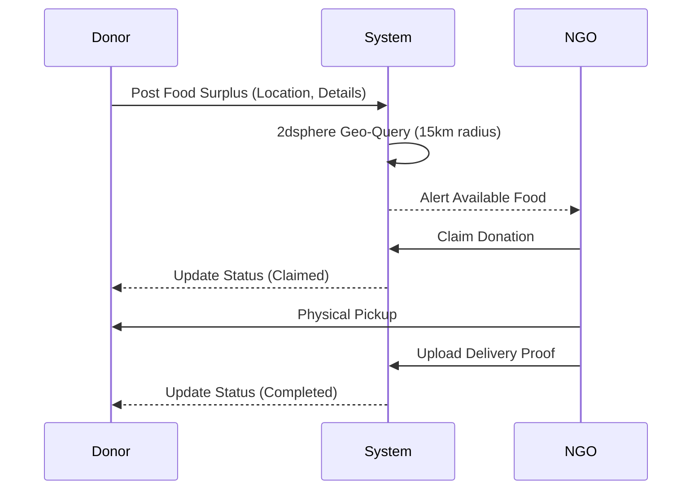
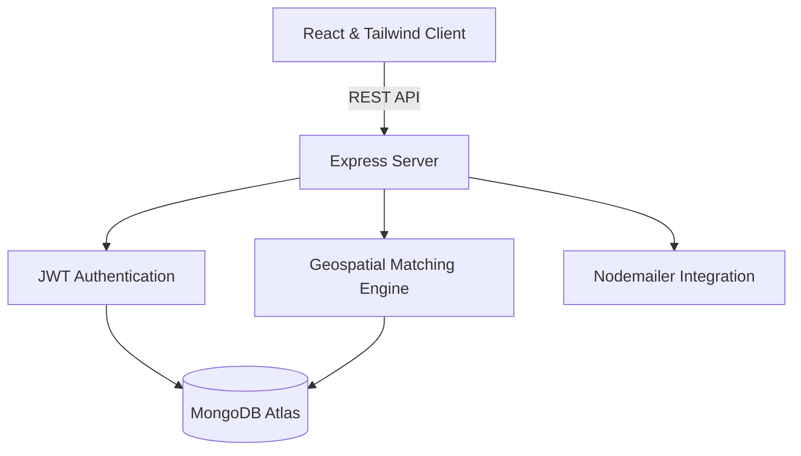

<div align="center">
  <h1>SARVWAN</h1>
  <p><strong>Food Redistribution Logistics Platform</strong></p>

  <p>
    
    
    
    
  </p>
</div>

<br />

## WHAT IS IT?
> [!NOTE]
> **Sarvwan** is a high-performance logistics and redistribution platform designed to bridge the gap between food surplus entities and verified Non-Governmental Organizations (NGOs). 
> 
> By leveraging geospatial indexing and real-time data, the architecture ensures rapid, traceable, and secure food allocation.

## WHY IS IT?
> [!IMPORTANT]
> **The Problem:** Globally, immense amounts of perfectly edible food are wasted daily by restaurants and event organizers, while local communities simultaneously face food insecurity.
>
> **The Solution:** Sarvwan eliminates the logistical friction of food donation. It provides a zero-latency geospatial matching system so that the moment surplus food becomes available, nearby verified NGOs are instantly notified and can coordinate a rapid pickup.

## SYSTEM WORKFLOWS



> [!TIP]
> ### 1. The Redistribution Lifecycle
> 1. **Surplus Registration:** A registered Donor logs a surplus manifest (food type, quantity, expiration window).
> 2. **Geospatial Broadcast:** The system computes a 15km radius using MongoDB 2dsphere indexing and alerts verified NGOs within proximity.
> 3. **Claim Protocol:** An authorized NGO reviews the manifest and issues a lock (claim) on the donation, preventing overlapping requests.
> 4. **Logistics & Collection:** The NGO physically retrieves the surplus from the Donor's registered coordinates.
> 5. **Audit & Verification:** Upon collection, the NGO uploads photographic proof of delivery/collection to finalize the transaction state.

> [!WARNING]
> ### 2. Entity Verification Workflow
> 1. **Registration:** An NGO submits organizational credentials via the registration gateway.
> 2. **Pending State:** The account is placed in a cryptographic hold, restricting API access to public routes only.
> 3. **Admin Audit:** A platform Administrator reviews the submitted credentials via the Admin Control Panel.
> 4. **Authorization:** Upon approval, the account permissions are elevated, granting access to the geospatial claim system.

## ARCHITECTURE & STACK



The platform is engineered using a decoupled client-server model, ensuring scalability and strict separation of concerns.

**Client Application**
- **Framework:** React 18 (Vite build system)
- **Styling:** Tailwind CSS v4, Shadcn UI (Radix Primitives)
- **State & Routing:** Zustand, React Router DOM
- **Typography:** Plus Jakarta Sans

**Server Application**
- **Runtime:** Node.js, Express.js
- **Database:** MongoDB (Mongoose ODM) with 2dsphere geospatial indexing
- **Security:** JSON Web Tokens (JWT), bcrypt, Helmet.js, express-rate-limit
- **Services:** Nodemailer (SMTP abstraction)

## DEPLOYMENT INSTRUCTIONS

### Prerequisites
- Node.js v18.0.0 or higher
- MongoDB instance (Local or Atlas)

### 1. Backend Initialization

Navigate to the root directory and install core dependencies.

```bash
npm install
```

Construct the local environment file (`.env`):

```env
PORT=5000
MONGO_URI=mongodb://localhost:27017/food-relief
JWT_SECRET=your_secure_cryptographic_key

# SMTP Configuration
EMAIL_USER=your_service_account@domain.com
EMAIL_PASS=your_app_specific_password

# Client Origin Reference
CLIENT_URL=http://localhost:5173
```

Execute the server instance:

```bash
npm run dev
```

### 2. Client Initialization

In a separate terminal instance, navigate to the client workspace.

```bash
cd client
npm install
npm run dev
```

The application client will securely connect to the local API gateway.

<br />
<div align="center">
  <small>&copy; Sarvwan Organization. All Rights Reserved.</small>
</div>
